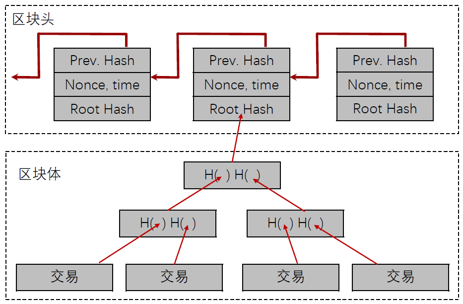

# Quiz

时间 40min

## 区块链主流分类和应用场景

- 公有链：任何个人和组织都有记账机会，参与共识。加密数字货币。
- 联盟链：由某个组织（联盟成员）指定多个预选的节点作为记账人。数据共享类场景。
- 私有链：对单独的个人或实体开放，在封闭的网络中运行，单独节点，一般用于内部开发和调试。票据管理、账务审计等场景。

## 哈希及其特性

**哈希函数**：确定性映射算法，可以将任意长度的输入数据编码为**固定长度的输出**（Hash 值）

**特性**：

- 耐碰撞性(Collision-resistance)：难以找到两个不同的输入 $x$ 和 $y$，使得$H(x)=H(y)$
- 隐秘性(Hiding)：给定输出值$H(x)$，难以推断出输入值 $x$
- 支持迷惑：对于每一个可能的 n-bit 输出 $y$，如果 $k$ 是随机性很强的值，那么找到一个合适的 $x$ 使得 $H(x||k)=y$ 不可能显著地低于 $2^n$的时间复杂度，也就是说不存在比随机尝试 $x$ 好很多的解决策略来找到解。

## 密钥分发：对称和非对称

- 对称分发，一个团体需要的密钥数：$C_n^2 = \frac{n(n-1)}{2}$
- 非对称分发：生成一个公钥，每个人一把私钥

## Bitcoin PoW 流程【交易记录等】

1. 节点收集一个区块的交易记录；

2. 节点通过大量计算找到一个随机数，按如下方法计算 Hash 值，满足条件：

   

   其中 Z 为 0x000...，0 的数量根据当前难度而定，难度越大 0 越多；

3. 找到随机数后，节点将当前区块的内容连同随机数一起广播，收到广播的节点验证其是否满足条件，若达成共识，认为该区块满足条件，则将其链接到区块链上。

## Bitcoin 缺点【浪费资源等】

- 吞吐量限制：平均出块时间 10min，块大小限制为 1MB/块，每一条交易至少 250 Bytes，算下来每秒大约记录 7 笔交易，吞吐量小；
- 安全隐患：
  - 仅使用 1 种签名算法（ECDSA / P256），加密原语可能会在 2040 年被破解；
  - 潜在的中心化：挖矿的大部分份额被矿场占有
  - 没有中心化监管，且具有匿名性，可能用于洗钱、非法交易等，被勒索、盗窃了也难以追踪
- 资源浪费：大量消耗 GPU 等硬件资源和电力资源计算哈希值，最终结果是得到数字货币，很难说对社会发展有什么贡献；

## 画出区块头和区块体的数据结构（包括关键参数）

## 最长链原则

当两个或更多节点同时找到正确的区块时，节点会收到 2 个以上的正确区块，导致区块链分叉；

最长链原则：

- 沿着最长链继续“挖掘”
- 后面跟 6 个区块以确认交易（上链后约 1 小时确认交易）

有效的原因：更长的链说明它周围聚集了更多的算力

## Coinbase【第一个交易】的特点

- 单输入单输出，交易数为 1；
- 哈希指针为空；
- output value = mining reward + transaction fees，Coinbase 中 mining reward 为 50 BTC，transaction fees 为 0；
- 具有特殊的 coinbase 参数。

## 硬分叉和软分叉的区别

**硬分叉**：区块链协议更新后，使用新版本得到的新链和使用旧版本的链同时存在，习惯于使用旧链的节点可以始终不更新，但这样也导致它们永远跟不上新链、无法与新链兼容。例如 2017 年为了增大吞吐量，把比特币拆分成 Bitcoin(BTC) 和 Bitcoin Cash(BCH) 两条链，新的 BCH 链扩大了每块的大小。分叉后的两条链至今同时存在。

**软分叉**：

- 引入新的特性，使得验证规则更严格：
  - 新协议下挖掘的区块一定可以被验证（包括旧节点）
  - 旧协议下挖掘的区块不一定可以被验证（无效块）
- 旧节点不得不去更新协议；
  - 不会产生硬分叉，但会临时产生一些小型分叉

## 隐藏题

我觉得可能是**共识算法**

1. 新交易将⼴播到所有节点；
2. 每个节点将收集到的新交易打包在⼀个区块中；
3. 在每个回合中，选举⼀个随机节点⼴播其区块（对记账节点的选取采用 Hash 算力的方式）；
4. 其他节点验证接收到的区块交易内容；
5. 节点接受该区块并将其链接到本地区块链中；
